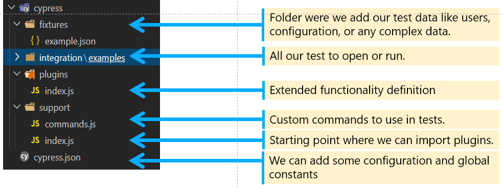
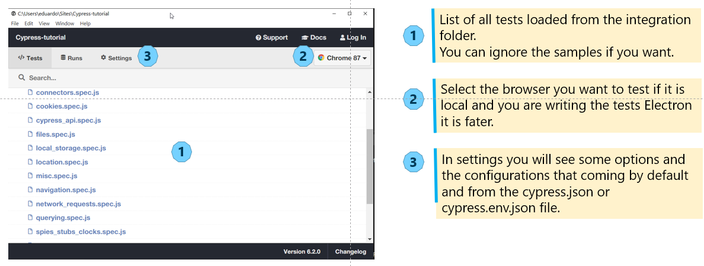

# Magento 2 Functional Testing

## Frontend tests on Magento 2 with Cypress

### Introduction
The tests located in the cypress/integration directory work with Magento2 luma template.

### Prerequisites

#### Install [Node.js][node]

    sudo apt install nodejs

#### Install [Cypress][cypress]
    
    npm install cypress -save-dev    
   
(--save-dev to recreate the json if you have it you don't need it.)

*If you are runing the tests in Win 10 remember to add the node System variable at Environment Variables: NODE_HOME path to node.js*

#### Optional but  cool install npx to execute npm packages where ever they are in your system.
    
    npm install -g npx


### How to run the tests
Run all the tests with the command below:

    npx cypress open

The first time cypress it is open it creates the cypress directory structure with needed sections sample tests and cypress.json file.




### Inspecting the electron application
An electron application will open showing all the tests holding in the cypress/integration folder.



### Using chanccejs to addd random data to your tests.

Install chancejs

    npm install chance


Example of how to use chance in your code

```
import Chance from 'Chance';
const chance = new Chance();
describe('Testing chance', function (){
   const company =chance.company();
   it('type company in duckduckgo.com', function () {
        cy.visit('https://duckduckgo.com/')
        cy.get('#search_form_input_homepage')
        .should('be.visible')
        .type(company)
    })
})
```

To see all chance possible methods https://chancejs.com/

### Snapshots plugin: visual testing, comparing images.

Install snapshots plugin

    npm i cypress-plugin-snapshots -S


Add to the cypress.json configuration file the following:

```
{
  "env": {
    "cypress-plugin-snapshots": {
      "imageConfig": {
        "threshold": 0.01
      }
    }
  },
  "ignoreTestFiles": [
    "**/__snapshots__/*",
    "**/__image_snapshots__/*"
  ]
}
```
Add the plugin configuration to plugins/index.js

```
const { initPlugin } = require('cypress-plugin-snapshots/plugin');
module.exports = (on, config) => {
  initPlugin(on, config);
  return config;
}
```
Add the import to the support/index.js

    import 'cypress-plugin-snapshots/commands';


Use it in your test

```
 it('should test snapshot', () => {
        cy.visit('https://duckduckgo.com/')
        cy.contains('h1', 'Tired of ').then( theSearch => {
            cy.wrap(theSearch).toMatchImageSnapshot()
        })
    })
```


[node]: https://nodejs.org/en/download/
[cypress]: https://docs.cypress.io/guides/overview/why-cypress.html#In-a-nutshell
