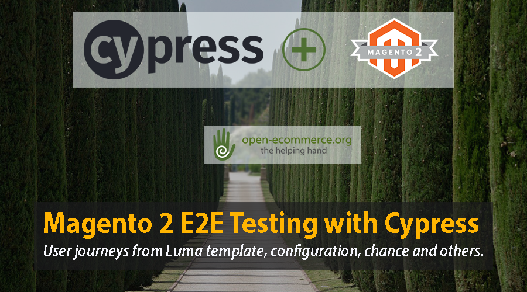

# Magento 2 Functional Testing

## Frontend tests on Magento 2 with Cypress

### Introduction
The tests located in the cypress/integration directory work with Magento2 luma template.

### Prerequisites

#### Install [Node.js][node]

    sudo apt install nodejs

#### Install [Cypress][cypress]
    
    npm install cypress -save-dev    
   
(--save-dev to recreate the json if you have it you don't need it.)

*If you are runing the tests in Win 10 remember to add the node System variable at Environment Variables: NODE_HOME path to node.js*

#### Optional but  cool install npx to execute npm packages where ever they are in your system.
    
    npm install -g npx

### How to run the tests
Run all the tests with the command below:

    npx cypress open

The first time cypress it is open it creates the cypress directory structure with needed sections sample tests and cypress.json file.

(folder-structure.png)

### Troubleshooting
...

[node]: https://nodejs.org/en/download/
[cypress]: https://docs.cypress.io/guides/overview/why-cypress.html#In-a-nutshell
